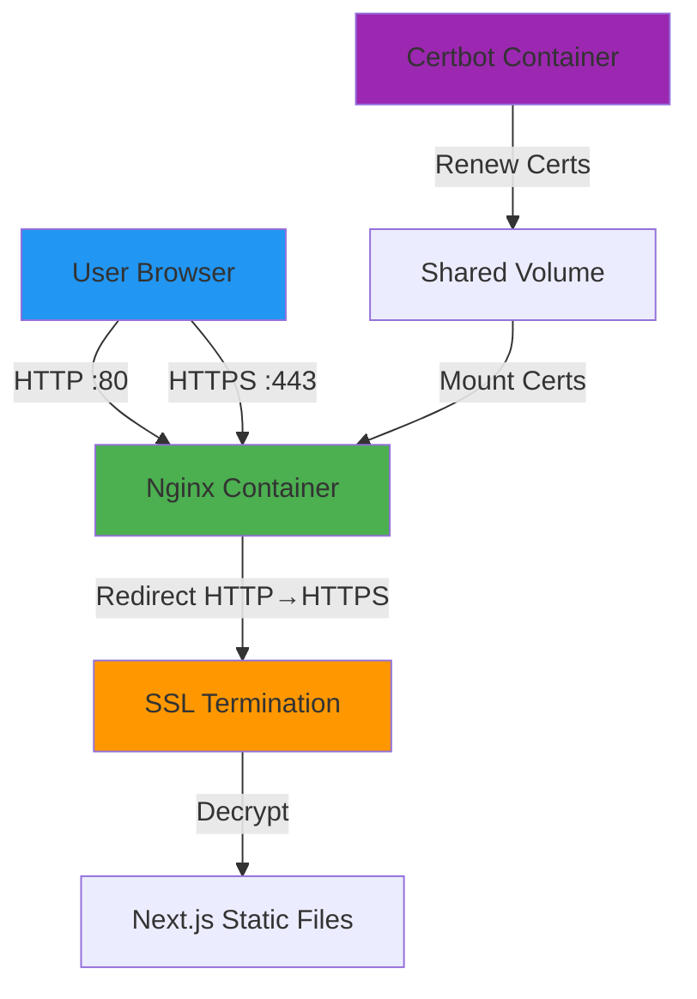

# SSL/HTTPS Setup Guide with Let's Encrypt

This guide explains how to add SSL/HTTPS support to your Vysio Landing Page deployment using Let's Encrypt and Certbot.

## Overview

We'll use **Certbot** with **Docker** to automatically obtain and renew SSL certificates from Let's Encrypt. The setup includes:

- ✅ Free SSL certificates from Let's Encrypt
- ✅ Automatic certificate renewal
- ✅ HTTP to HTTPS redirect
- ✅ A+ SSL rating configuration
- ✅ Zero-downtime certificate updates

## Architecture with SSL



## Prerequisites

Before setting up SSL, you need:

1. **Domain Name**: A registered domain (e.g., `vysio.example.com`)
2. **DNS Configuration**: Domain pointing to your VPS IP
3. **VPS Access**: SSH access to your server
4. **Ports Open**: Ports 80 and 443 accessible
5. **Email Address**: For Let's Encrypt notifications

## Updated File Structure

```
vysio-landing-page/
├── docker-compose.yml              # Updated with SSL support
├── docker-compose.ssl.yml          # SSL-specific configuration
├── nginx.conf                      # HTTP configuration (port 80)
├── nginx-ssl.conf                  # HTTPS configuration (port 443)
├── setup-ssl.sh                    # SSL setup automation script
└── certbot/                        # Certificate storage (created automatically)
    ├── conf/                       # Certbot configuration
    └── www/                        # ACME challenge files
```

## Step-by-Step Setup

### Step 1: Initial Deployment (HTTP Only)

First, deploy your application without SSL:

```bash
# On your VPS
cd /opt/vysio-landing
docker-compose up -d
```

Verify it's accessible via HTTP: `http://your-domain.com`

### Step 2: DNS Configuration

Ensure your domain points to your VPS:

```bash
# Check DNS resolution
dig your-domain.com

# Should return your VPS IP address
```

### Step 3: Run SSL Setup Script

```bash
# Make script executable
chmod +x setup-ssl.sh

# Run SSL setup (interactive)
./setup-ssl.sh
```

The script will:
1. Prompt for your domain name
2. Prompt for your email address
3. Stop the current container
4. Request SSL certificate from Let's Encrypt
5. Update docker-compose configuration
6. Restart with SSL enabled

### Step 4: Verify HTTPS

Visit your site: `https://your-domain.com`

Check SSL rating: https://www.ssllabs.com/ssltest/

## Docker Compose Configuration

### Basic Configuration (docker-compose.yml)

```yaml
version: '3.8'

services:
  web:
    image: ${DOCKER_IMAGE_NAME}:latest
    container_name: vysio-landing
    ports:
      - "80:80"
    restart: always
    volumes:
      - ./nginx.conf:/etc/nginx/nginx.conf:ro
```

### SSL Configuration (docker-compose.ssl.yml)

```yaml
version: '3.8'

services:
  web:
    image: ${DOCKER_IMAGE_NAME}:latest
    container_name: vysio-landing
    ports:
      - "80:80"
      - "443:443"
    restart: always
    volumes:
      - ./nginx-ssl.conf:/etc/nginx/nginx.conf:ro
      - ./certbot/conf:/etc/letsencrypt:ro
      - ./certbot/www:/var/www/certbot:ro
    depends_on:
      - certbot

  certbot:
    image: certbot/certbot
    container_name: certbot
    volumes:
      - ./certbot/conf:/etc/letsencrypt
      - ./certbot/www:/var/www/certbot
    entrypoint: "/bin/sh -c 'trap exit TERM; while :; do certbot renew; sleep 12h & wait $${!}; done;'"
```

## Nginx SSL Configuration

### HTTP Configuration (nginx.conf)

```nginx
events {
    worker_connections 1024;
}

http {
    include /etc/nginx/mime.types;
    default_type application/octet-stream;

    server {
        listen 80;
        server_name _;

        root /usr/share/nginx/html;
        index index.html;

        location / {
            try_files $uri $uri/ /index.html;
        }
    }
}
```

### HTTPS Configuration (nginx-ssl.conf)

```nginx
events {
    worker_connections 1024;
}

http {
    include /etc/nginx/mime.types;
    default_type application/octet-stream;

    # HTTP - Redirect to HTTPS
    server {
        listen 80;
        server_name your-domain.com www.your-domain.com;

        location /.well-known/acme-challenge/ {
            root /var/www/certbot;
        }

        location / {
            return 301 https://$host$request_uri;
        }
    }

    # HTTPS
    server {
        listen 443 ssl http2;
        server_name your-domain.com www.your-domain.com;

        # SSL Configuration
        ssl_certificate /etc/letsencrypt/live/your-domain.com/fullchain.pem;
        ssl_certificate_key /etc/letsencrypt/live/your-domain.com/privkey.pem;

        # SSL Security Settings
        ssl_protocols TLSv1.2 TLSv1.3;
        ssl_ciphers HIGH:!aNULL:!MD5;
        ssl_prefer_server_ciphers on;
        ssl_session_cache shared:SSL:10m;
        ssl_session_timeout 10m;

        # Security Headers
        add_header Strict-Transport-Security "max-age=31536000; includeSubDomains" always;
        add_header X-Frame-Options "SAMEORIGIN" always;
        add_header X-Content-Type-Options "nosniff" always;
        add_header X-XSS-Protection "1; mode=block" always;

        # Application
        root /usr/share/nginx/html;
        index index.html;

        # Gzip Compression
        gzip on;
        gzip_vary on;
        gzip_min_length 1024;
        gzip_types text/plain text/css text/xml text/javascript 
                   application/x-javascript application/xml+rss 
                   application/javascript application/json;

        location / {
            try_files $uri $uri/ /index.html;
        }

        # Cache static assets
        location ~* \.(jpg|jpeg|png|gif|ico|css|js|svg|woff|woff2|ttf|eot)$ {
            expires 1y;
            add_header Cache-Control "public, immutable";
        }
    }
}
```

## SSL Setup Script (setup-ssl.sh)

```bash
#!/bin/bash

# Colors for output
RED='\033[0;31m'
GREEN='\033[0;32m'
YELLOW='\033[1;33m'
NC='\033[0m' # No Color

echo -e "${GREEN}=== SSL Setup for Vysio Landing Page ===${NC}\n"

# Prompt for domain
read -p "Enter your domain name (e.g., vysio.example.com): " DOMAIN
read -p "Enter your email address: " EMAIL

# Validate inputs
if [ -z "$DOMAIN" ] || [ -z "$EMAIL" ]; then
    echo -e "${RED}Error: Domain and email are required${NC}"
    exit 1
fi

echo -e "\n${YELLOW}Setting up SSL for: $DOMAIN${NC}"
echo -e "${YELLOW}Email: $EMAIL${NC}\n"

# Create certbot directories
mkdir -p certbot/conf
mkdir -p certbot/www

# Stop current container
echo -e "${YELLOW}Stopping current container...${NC}"
docker-compose down

# Request certificate
echo -e "${YELLOW}Requesting SSL certificate from Let's Encrypt...${NC}"
docker run -it --rm \
    -v $(pwd)/certbot/conf:/etc/letsencrypt \
    -v $(pwd)/certbot/www:/var/www/certbot \
    certbot/certbot certonly \
    --webroot \
    --webroot-path=/var/www/certbot \
    --email $EMAIL \
    --agree-tos \
    --no-eff-email \
    -d $DOMAIN

# Check if certificate was obtained
if [ ! -d "certbot/conf/live/$DOMAIN" ]; then
    echo -e "${RED}Failed to obtain certificate${NC}"
    exit 1
fi

# Update nginx-ssl.conf with domain
sed -i "s/your-domain.com/$DOMAIN/g" nginx-ssl.conf

# Switch to SSL configuration
echo -e "${YELLOW}Switching to SSL configuration...${NC}"
docker-compose -f docker-compose.yml -f docker-compose.ssl.yml up -d

echo -e "\n${GREEN}✅ SSL setup complete!${NC}"
echo -e "${GREEN}Your site is now available at: https://$DOMAIN${NC}"
echo -e "\n${YELLOW}Certificate will auto-renew every 12 hours${NC}"
```

## Certificate Renewal

Certificates are automatically renewed by the Certbot container every 12 hours.

### Manual Renewal

```bash
# Force renewal
docker-compose exec certbot certbot renew --force-renewal

# Reload Nginx
docker-compose exec web nginx -s reload
```

### Check Certificate Expiry

```bash
# View certificate details
docker-compose exec certbot certbot certificates
```

## Troubleshooting

### Issue: Certificate Request Fails

**Solution**:
```bash
# Ensure port 80 is accessible
sudo ufw allow 80
sudo ufw allow 443

# Check DNS
dig your-domain.com

# Try standalone mode
docker run -it --rm \
    -p 80:80 \
    -v $(pwd)/certbot/conf:/etc/letsencrypt \
    certbot/certbot certonly \
    --standalone \
    --email your@email.com \
    --agree-tos \
    -d your-domain.com
```

### Issue: Nginx Won't Start with SSL

**Solution**:
```bash
# Check certificate paths
ls -la certbot/conf/live/your-domain.com/

# Verify nginx config
docker-compose exec web nginx -t

# Check logs
docker-compose logs web
```

### Issue: Mixed Content Warnings

**Solution**: Ensure all resources use HTTPS or relative URLs in your Next.js app.

## Security Best Practices

1. **HSTS**: Enabled with 1-year max-age
2. **TLS Versions**: Only TLS 1.2 and 1.3
3. **Strong Ciphers**: HIGH security ciphers only
4. **Security Headers**: X-Frame-Options, CSP, etc.
5. **Certificate Monitoring**: Set up expiry alerts

## Cost

- **Let's Encrypt**: FREE
- **Renewal**: Automatic, FREE
- **No hidden costs**

## Testing SSL Configuration

```bash
# Test SSL rating
curl -I https://your-domain.com

# Check certificate
openssl s_client -connect your-domain.com:443 -servername your-domain.com

# Online tools
# - https://www.ssllabs.com/ssltest/
# - https://securityheaders.com/
```

## Migration from HTTP to HTTPS

1. Deploy with HTTP first
2. Verify application works
3. Run SSL setup script
4. Test HTTPS access
5. Update any hardcoded HTTP URLs
6. Enable HSTS header

## Monitoring

### Certificate Expiry Monitoring

```bash
# Add to crontab for email alerts
0 0 * * * docker-compose exec certbot certbot certificates | grep "VALID" || echo "Certificate expiring soon!"
```

### Nginx Access Logs

```bash
# View HTTPS traffic
docker-compose logs web | grep "443"
```

## Rollback to HTTP

If you need to rollback:

```bash
# Stop SSL configuration
docker-compose -f docker-compose.ssl.yml down

# Start basic configuration
docker-compose up -d
```

## Next Steps After SSL Setup

1. ✅ Update DNS records (if using CDN)
2. ✅ Configure HSTS preload
3. ✅ Set up monitoring alerts
4. ✅ Update application URLs to HTTPS
5. ✅ Test all functionality over HTTPS

---

**Estimated Setup Time**: 15-30 minutes
**Certificate Validity**: 90 days (auto-renewed)
**Renewal Frequency**: Every 60 days (automatic)