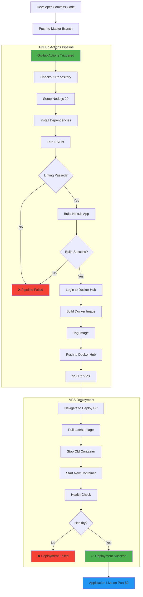
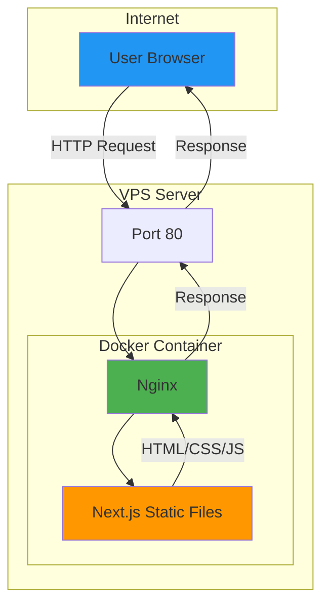
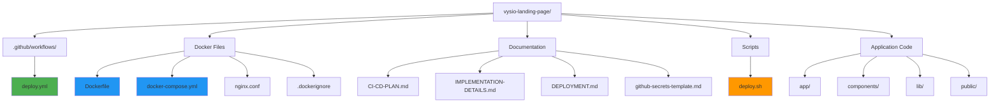
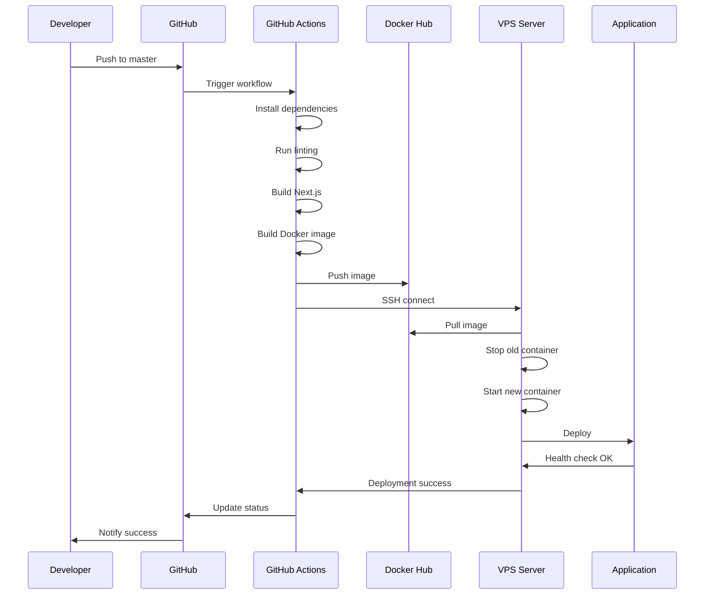
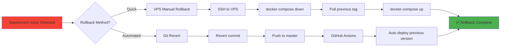
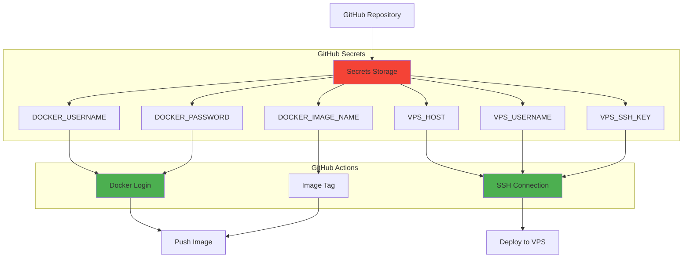
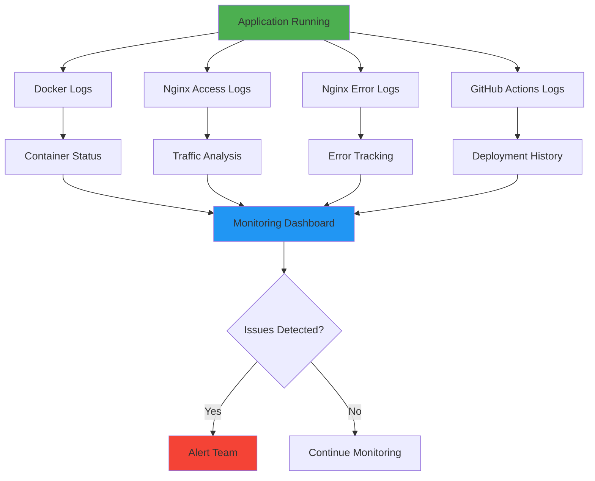
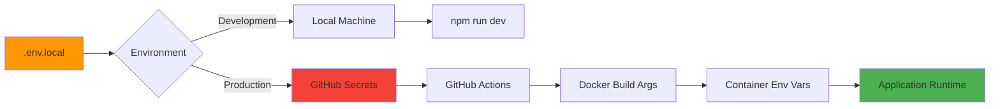
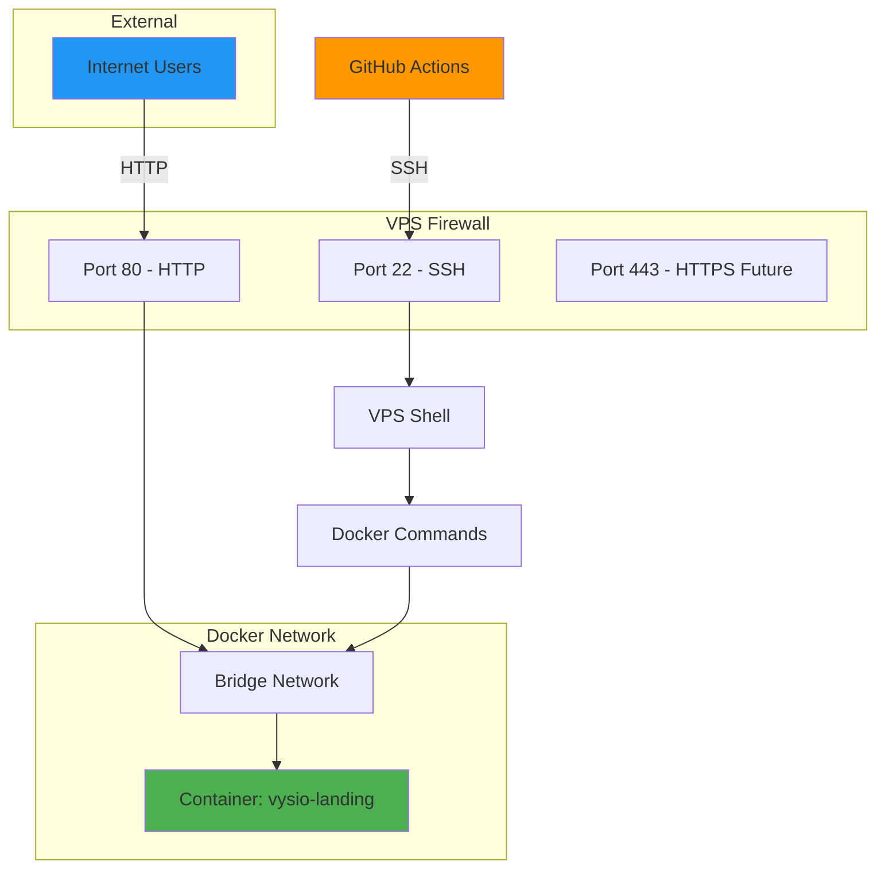

# CI/CD Workflow Diagrams

## Complete Pipeline Flow



## Docker Build Process

```mermaid
graph LR
    A[Source Code] --> B[Dockerfile]
    
    subgraph "Stage 1: Builder"
        B --> C[Node.js 20 Alpine]
        C --> D[Install Dependencies]
        D --> E[Build Next.js]
        E --> F[Generate Standalone]
    end
    
    subgraph "Stage 2: Production"
        F --> G[Nginx Alpine]
        G --> H[Copy Built Files]
        H --> I[Copy Nginx Config]
        I --> J[Final Image ~50MB]
    end
    
    J --> K[Push to Docker Hub]
    K --> L[Pull on VPS]
    L --> M[Run Container]
    
    style F fill:#4CAF50
    style J fill:#2196F3
    style M fill:#FF9800
```



## VPS Deployment Architecture



## File Structure Overview



## Deployment Sequence



## Rollback Process



## Security Flow



## Monitoring & Logs



## Environment Variables Flow



## Network Architecture



---

## Quick Reference Commands

### GitHub Actions
```bash
# View workflow runs
gh run list

# View specific run
gh run view <run-id>

# Re-run failed workflow
gh run rerun <run-id>
```

### VPS Management
```bash
# Check container status
docker-compose ps

# View logs
docker-compose logs -f

# Restart container
docker-compose restart

# Stop container
docker-compose down

# Start container
docker-compose up -d
```

### Docker Hub
```bash
# List images
docker images

# Remove old images
docker image prune -a

# Pull specific tag
docker pull username/vysio-landing:tag
```

---

**Legend**:
- 🟢 Green: Success/Active state
- 🔵 Blue: Process/Action
- 🟠 Orange: Warning/Manual action
- 🔴 Red: Error/Security sensitive